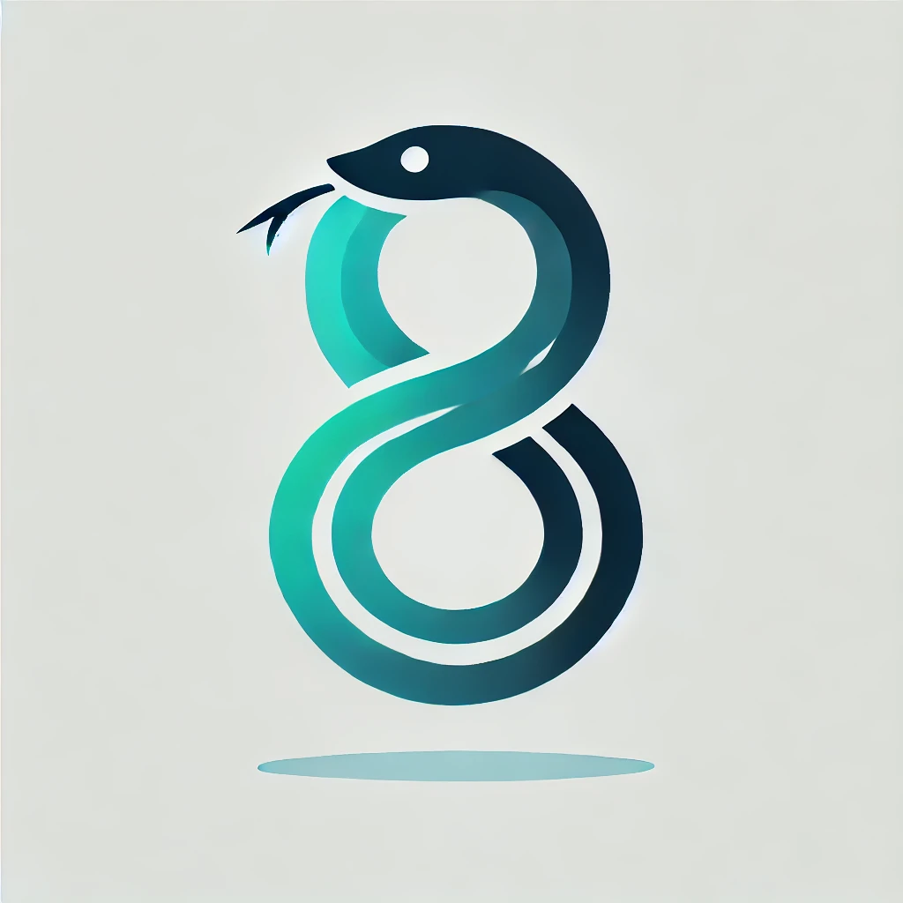

# Ouroboros: AI-Driven Self-Improving Experimentation System



Ouroboros is an advanced AI system designed to conduct experiments, improve itself, and push the boundaries of AI research. It operates in cycles, running experiments, analyzing results, and building upon its own knowledge.

## Features

- Self-improving AI system using the Claude 3.5 model
- Docker-based sandboxed environment for safe code execution
- Git integration for version control of experiments
- SQLite database for storing experiment results and metadata
- Configurable experiment parameters (max actions, time limits, etc.)
- Search functionality to reference previous experiments
- Google search capability for internet research
- Webpage content loading for information gathering
- Automated experiment cycle management

## Prerequisites

- Python 3.9+
- Docker
- Git
- Google API key and Custom Search Engine ID (optional, for Google search feature)

## Installation

1. Clone the repository:
   git clone https://github.com/yourusername/ouroboros.git
   cd ouroboros

2. Create a virtual environment and activate it:
   python -m venv venv
   source venv/bin/activate  # On Windows, use `venv\Scripts\activate`

3. Install the required packages:
   pip install -r requirements.txt

4. Create a `config.ini` file in the project root with the following content:
```
   [Anthropic]
   API_KEY = your_anthropic_api_key_here

   [Google]
   API_KEY = your_google_api_key_here
   CSE_ID = your_custom_search_engine_id_here

   [Docker]
   MemoryLimit = 512m
   CPUQuota = 50000
   Timeout = 300
   NetworkAccess = false

   [Search]
   MaxResults = 5

   [Scheduling]
   IntervalMinutes = 60

   [Experiment]
   MaxActions = 10
   TimeLimit = 3600
```

5. (Optional) Create an `access.txt` file in the project root with any additional API keys or credentials you want to make available to the AI:
   SOME_API_KEY=your_api_key_here

## Usage

Run the Ouroboros system:

`python ouroboros.py`

The system will start running experiments in cycles, with each cycle lasting up to the specified time limit or until the maximum number of actions is reached.

## Configuration

You can adjust the following parameters in the `config.ini` file:

- `Anthropic`: Set your Claude API key
- `Google`: Set your Google API key and Custom Search Engine ID for the Google search feature
- `Docker`: Configure resource limits for Docker containers
- `Search`: Set the maximum number of results returned by the search function
- `Scheduling`: Set the interval between experiment cycles
- `Experiment`: Configure the maximum number of actions and time limit for each experiment

## New Features

- Google Search: The AI can now perform Google searches using the `[GOOGLE]` action if the Google API key and CSE ID are configured.
- Webpage Loading: The AI can load and summarize webpage content using the `[LOADURL]` action.

These features allow the AI to conduct internet research and gather information to enhance its experiments and decision-making process.

## Project Structure

- `ouroboros.py`: Main script containing the Ouroboros system
- `config.ini`: Configuration file for system parameters and API keys
- `access.txt`: (Optional) File containing additional API keys or credentials for the AI
- `ouroboros.db`: SQLite database storing experiment results and metadata
- `experiments/`: Directory containing individual experiment files and Git repository
- `ouroboros.log`: Log file for system events and errors

## How It Works

1. The system initializes the database and Git repository.
2. In each cycle, Ouroboros:
   - Retrieves the previous experiment's data
   - Prompts the AI with the current state and experiment history
   - Executes the AI's chosen action (run code, modify Dockerfile, search, Google search, load URL, etc.)
   - Records the results and updates the experiment history
   - Continues until finalization or reaching the action/time limit
3. The experiment results are stored in the database and committed to Git.
4. The system waits for the configured interval before starting the next cycle.

## Safety and Ethical Considerations

- All code execution happens within isolated Docker containers.
- The system has built-in limits on resources, actions, and execution time.
- Experiment results and AI decisions are logged for review and auditing.
- Internet access for research is controlled and can be disabled if needed.

## Contributing

Contributions to Ouroboros are welcome! Please submit pull requests with any improvements or bug fixes.

## License

Ouroboros is licensed under the Ouroboros Public License, Version 1.0 (the "License"); you may not use this software except in compliance with the License. You may use, distribute, and modify the software under the terms of the License, but you are not permitted to sell or repurpose the software for commercial distribution without explicit permission.

### Terms and Conditions

1. **Permission is granted to use, copy, modify, and distribute this software for any purpose, with or without fee, subject to the following conditions:**
   - The original author must be credited.
   - Redistributions in source or binary forms must include the original license and terms.
   - You may not sell or repurpose the software for commercial distribution.

2. **Disclaimer:**
   - The software is provided "as is", without warranty of any kind, express or implied, including but not limited to the warranties of merchantability, fitness for a particular purpose, and noninfringement.
   - In no event shall the authors be liable for any claim, damages, or other liability, whether in an action of contract, tort, or otherwise, arising from, out of, or in connection with the software or the use or other dealings in the software.

For more details, see the [LICENSE.md](LICENSE.md) file.

## Disclaimer

This system has significant capabilities and potential risks. Always run it in a controlled environment, monitor its activities closely, and be prepared to intervene if necessary. Regularly review the AI's actions and outputs to ensure it's operating within expected parameters and ethical guidelines.