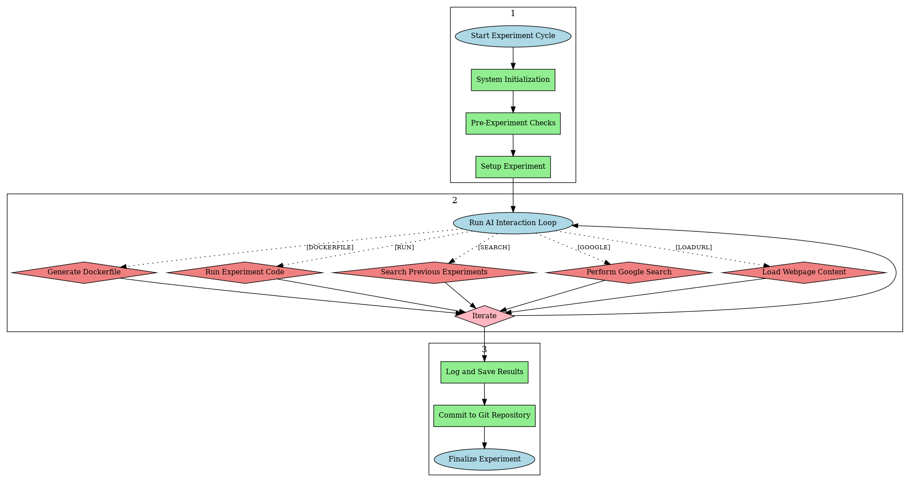

# Ouroboros: AI-Driven Self-Improving Experimentation System


Ouroboros is an advanced AI system designed to conduct experiments, improve itself, and push the boundaries of AI research. It operates in cycles, running experiments, analyzing results, and building upon its own knowledge.

## Summary

**Ouroboros** is an autonomous AI system designed to help automate AI research and development. Leveraging the advanced capabilities of large language models like Claude 3.5 and GPT-4, Ouroboros conducts experiments, analyzes results, and iteratively improves upon its own knowledge and capabilities. This self-improving cycle mimics the ouroboros symbol, representing eternal growth and evolution in AI.

## Features

- **Flexible AI Model Support**: Utilizes either Claude (Anthropic) or GPT (OpenAI) models for sophisticated reasoning and decision-making.
- **Sandboxed Environment**: Executes code safely within Docker containers, ensuring system integrity.
- **Version Control**: Integrates with Git to maintain a comprehensive history of all experiments.
- **Persistent Storage**: Uses SQLite to store experiment results, metadata, and AI insights.
- **Configurable Parameters**: Allows fine-tuning of experiment duration, action limits, resource allocation, and AI model selection.
- **Knowledge Retention**: Can search and reference previous experiments for continuous learning.
- **Internet Research**: Capable of performing Google searches and loading webpage content for information gathering.
- **Automated Cycle Management**: Schedules and executes experiment cycles with minimal human intervention.
- **Extensive Logging**: Maintains detailed logs for monitoring, debugging, and auditing purposes.

## How It Works

1. **Initialization**: The system sets up the database, Git repository, and Docker environment.
2. **Experiment Cycle**:
   - Retrieves context from previous experiments
   - Generates AI prompt with current state and experiment history
   - AI decides on the next action (run code, modify environment, research, etc.)
   - Executes the chosen action securely
   - Records results and updates experiment history
   - Repeats until experiment completion or reaching predefined limits
3. **Data Persistence**: Stores results in the database and commits to Git
4. **Scheduling**: Waits for the configured interval before initiating the next cycle



## Ethical Considerations and Safety Measures

- **Isolated Execution**: All code runs within restricted Docker containers
- **Resource Limitations**: Strict controls on computational resources and execution time
- **Audit Trail**: Comprehensive logging of AI decisions and actions
- **Configurable Internet Access**: Research capabilities can be restricted if needed
- **Regular Review**: Encourages human oversight and intervention when necessary

## Potential Applications

- Advancing AI research methodologies
- Automated software testing and optimization
- Exploring novel algorithms and data structures
- Investigating AI safety and alignment strategies
- Accelerating scientific discovery in various domains

## Prerequisites

- **Python 3.9+**: Ensure you have Python version 3.9 or later installed.
- **Docker**: Install Docker to run experiments in a secure, sandboxed environment.
- **Git**: Git is required for version control of experiment history.
- **Sufficient Disk Space**: Ensure you have enough disk space to store AI-generated docker images, experiment results, and logs.
- **Anthropic API Key**: Required **if** leveraging Claude AI models.
- **OpenAI API Key**: Required **if** leveraging OpenAI AI models.
- **Google API Key and Custom Search Engine ID** (optional): These are required for enabling the Google search feature.
   > **Note:** The Google API feature is optional and not required for the base functionality of Ouroboros.

## Installation

1. Clone the repository:
   - `git clone https://github.com/yourusername/ouroboros.git`
   - `cd ouroboros`

2. Create a virtual environment and activate it:
   - `python -m venv venv`
   - On Linux, use `source venv/bin/activate`
   - On Windows, use `venv\Scripts\activate`

3. Install the required packages:
   - `pip install -r requirements.txt`

4. Create a `config.ini` file in the project root with the following content:
```
[AI]
PROVIDER = claude  # Options: claude, openai

[Anthropic]
API_KEY = your_anthropic_api_key_here
MODEL = claude-3-5-sonnet-20240620
MAX_OUTPUT_TOKENS = 4096
TEMPERATURE = 0.7

[OpenAI]
API_KEY = your_openai_api_key_here
MODEL = gpt-3.5-turbo
MAX_TOKENS = 4096
TEMPERATURE = 0.7

[Google]
API_KEY = your_google_api_key_here
CSE_ID = your_custom_search_engine_id_here
MaxResults = 5

[Docker]
MemoryLimit = 512m
CPUQuota = 50000
Timeout = 300
NetworkAccess = false
EnableCleanup = true
KeepLastNImages = 5

[Search]
MaxResults = 5

[Scheduling]
IntervalMinutes = 60
RunFirstImmediately = true

[Experiment]
MaxActions = 10
MaxErrors = 3
TimeLimit = 3600
```
> **Note:** You can use config.ini.example as a template.

> **Note:** The Google API section is optional and not required for the base functionality of Ouroboros.

5. (Optional) Create an `access.txt` file in the project root to include any additional API keys or credentials you want to make available to the AI during experiments. Use the following format:

   ```plaintext
   [key]=[value]
   SOME_API_KEY=your_api_key_here
   ```
> **Note:** You can use access.txt.example as a template.

## Configuration

You can adjust the following parameter sections in the `config.ini` file:

- `AI`: Choose the AI provider (claude or openai)
- `Anthropic`: Set your Claude API key and model parameters
- `OpenAI`: Set your OpenAI API key and model parameters
- `Google`: Set your Google API key and Custom Search Engine ID for the Google search feature
- `Docker`: Configure resource limits for Docker containers
- `Search`: Set the maximum number of results returned by the experiment knowledge search function
- `Scheduling`: Set the interval between experiment cycles
- `Experiment`: Configure the maximum number of actions and time limit for each experiment

## Project Structure

- `ouroboros.py`: Main script containing the Ouroboros system
- `config.ini`: Configuration file for system parameters and API keys
- `access.txt`: (Optional) File containing additional API keys or credentials for the AI
- `ouroboros.db`: SQLite database storing experiment results and metadata
- `experiments/`: Directory containing individual experiment files and Git repository
- `ouroboros.log`: Log file for system events and errors

## Usage

Run the Ouroboros system:

`python ouroboros.py`

The system will start running experiments in cycles, with each cycle lasting up to the specified time limit or until the maximum number of actions is reached.

## Contribute

Ouroboros has a goal of helping make significant steps towards autonomous AI research and development. We welcome contributions, suggestions, and discussions on improving and expanding Ouroboros' capabilities.

## License

Ouroboros is licensed under the Ouroboros Public License, Version 1.0 (the "License"); you may not use this software except in compliance with the License. You may use, distribute, and modify the software under the terms of the License, but you are not permitted to sell or repurpose the software for commercial distribution without explicit permission.

### Terms and Conditions

1. **Permission is granted to use, copy, modify, and distribute this software for any purpose, with or without fee, subject to the following conditions:**
   - The original author must be credited.
   - Redistributions in source or binary forms must include the original license and terms.
   - You may not sell or repurpose the software for commercial distribution.

2. **Disclaimer:**
   - The software is provided "as is", without warranty of any kind, express or implied, including but not limited to the warranties of merchantability, fitness for a particular purpose, and noninfringement.
   - In no event shall the authors be liable for any claim, damages, or other liability, whether in an action of contract, tort, or otherwise, arising from, out of, or in connection with the software or the use or other dealings in the software.

For more details, see the [LICENSE.md](LICENSE.md) file.

## Disclaimer

This system has significant capabilities and potential risks. Always run it in a controlled environment, monitor its activities closely, and be prepared to intervene if necessary. Regularly review the AI's actions and outputs to ensure it's operating within expected parameters and ethical guidelines.